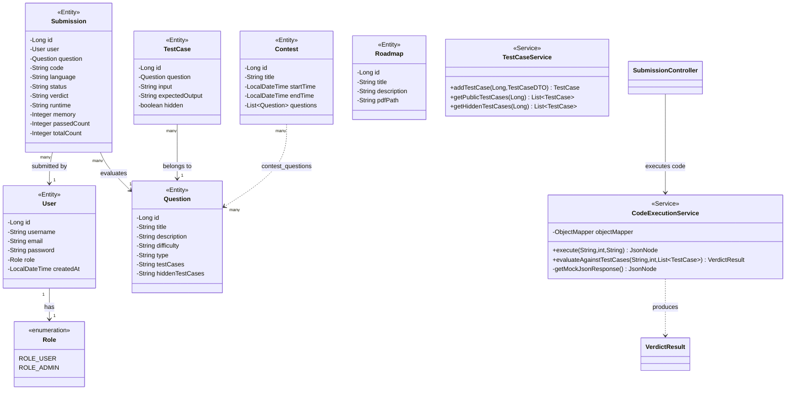

# TechCodeSolution — Backend UML Class Diagram

> **Stack:** Spring Boot · Spring Security (JWT) · JPA/Hibernate · MySQL
>
> **Package root:** `com.cfs.TechCodesolution`

---

## Full Class Diagram

---

## API Endpoints Summary

| Method | Endpoint | Auth | Description |
|--------|----------|------|-------------|
| `POST` | `/api/auth/signin` | Public | Login, returns JWT |
| `POST` | `/api/auth/signup` | Public | Register new user |
| `GET` | `/api/questions` | Public | List all questions |
| `POST` | `/api/submissions/run` | Auth | Run code (Mock) |
| `POST` | `/api/submissions/submit/{qId}` | Auth | Submit & Evaluate (Mock) |
| `GET` | `/api/roadmaps` | Auth | List roadmaps |
| `GET` | `/api/admin/users` | ADMIN | List all users |
