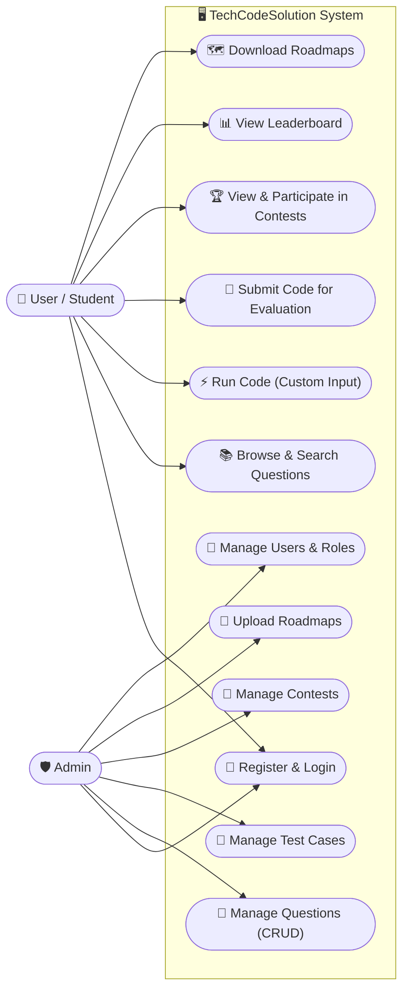
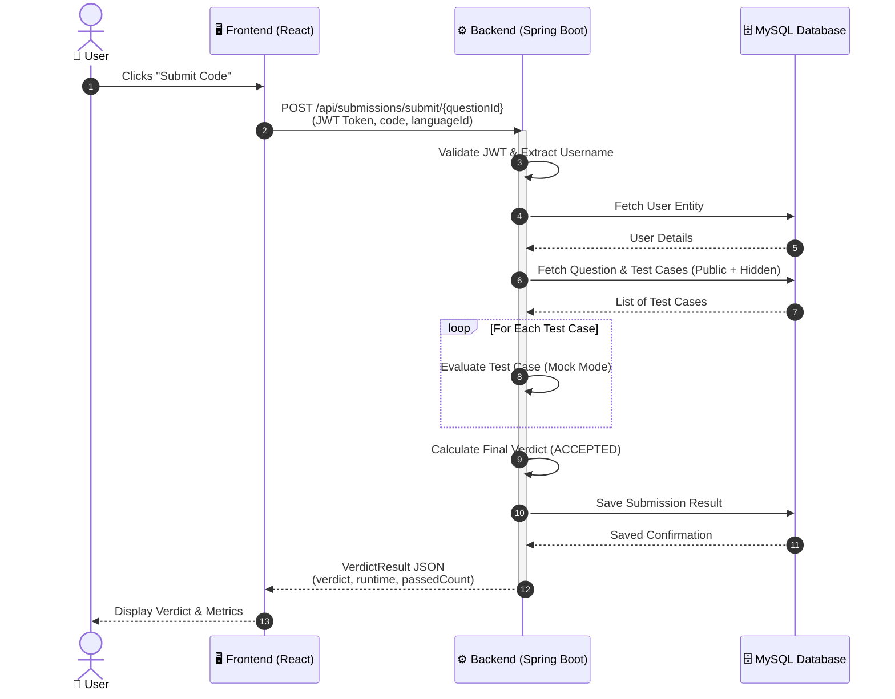
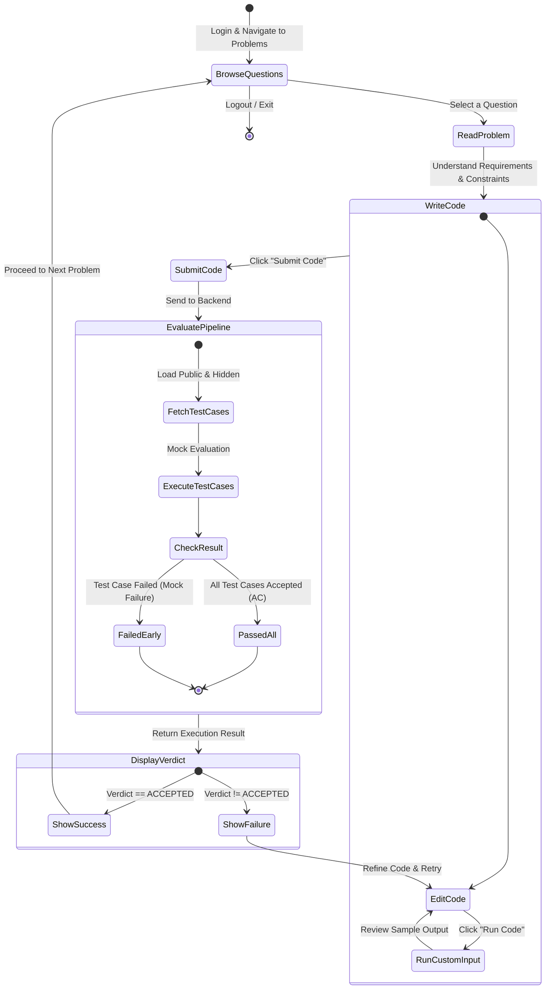

# TechCodeSolution — System Diagrams

This document contains the Use Case Diagram, Sequence Diagram, and Activity Diagram for the TechCodeSolution platform.

---

## 1. Use Case Diagram

---

## 2. Sequence Diagram (Code Submission Flow)

---

## 3. Activity Diagram (Problem Solving Workflow)

