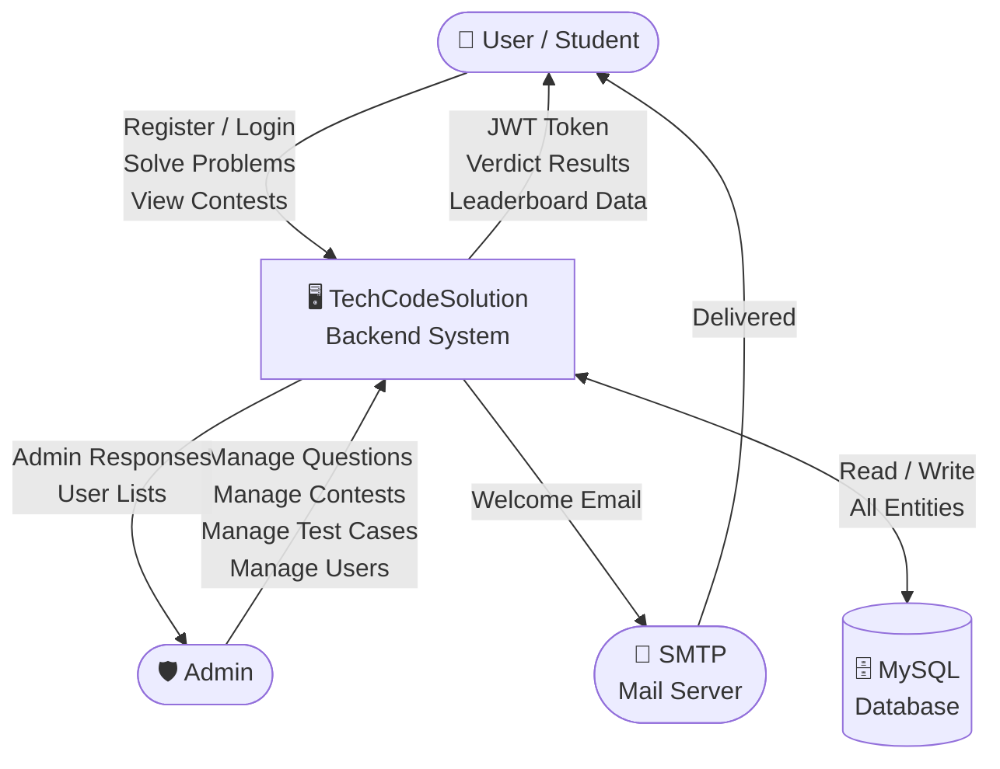
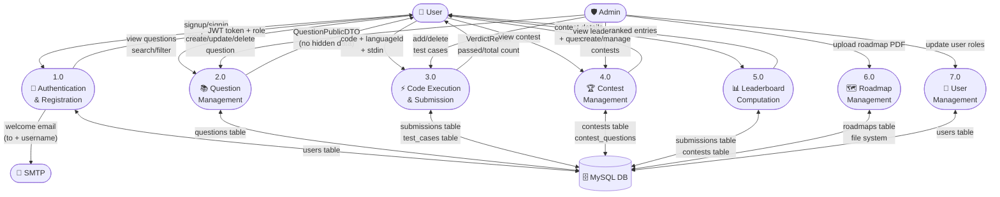
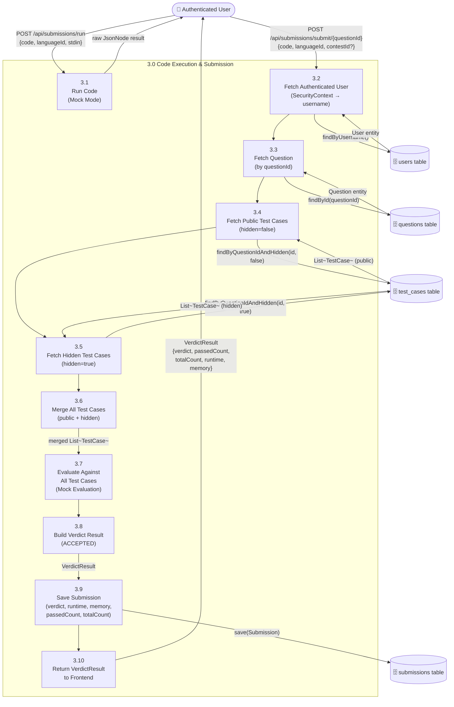

# TechCodeSolution — Complete Data Flow Diagram (DFD)

> **Stack:** Spring Boot · Spring Security (JWT) · JPA/Hibernate · MySQL · JavaMail · WebSocket

---

## Level 0 — Context Diagram (System Overview)

---

## Level 1 — Main Processes

---

## Level 2 — Process 3: Code Execution & Submission

---

## Data Store Summary

| Data Store | Table / Location | Key Fields | Accessed By |
|---|---|---|---|
| **Users** | `users` | id, username, email, password, role, createdAt | AuthController, UserController, AdminController |
| **Questions** | `questions` | id, title, difficulty, type, testCases, hiddenTestCases, boilerplates, link | QuestionController, SubmissionController |
| **Test Cases** | `test_cases` | id, question_id, input, expectedOutput, hidden | TestCaseController, TestCaseService, SubmissionController |
| **Submissions** | `submissions` | id, user_id, question_id, code, language, verdict, runtime, memory, contestId | SubmissionController, LeaderboardService |
| **Contests** | `contests` | id, title, startTime, endTime, durationMinutes, isPublished | ContestController, LeaderboardService |
| **Roadmaps** | `roadmaps` | id, title, description, pdfPath | RoadmapController |
| **PDF Files** | `uploads/` (filesystem) | UUID filename | FileStorageService |

---

## External System Interfaces

| External System | Protocol | Direction | Data Sent | Data Received |
|---|---|---|---|---|
| **SMTP Mail Server** | SMTP | Outbound | `to`, `subject`, `text` (welcome message) | Delivery status |
| **React Frontend** | HTTP/HTTPS REST | Bidirectional | JSON requests with JWT Bearer token | JSON responses |
| **Browser WebSocket** | WS | Bidirectional | Connection events | Live user count integer |
